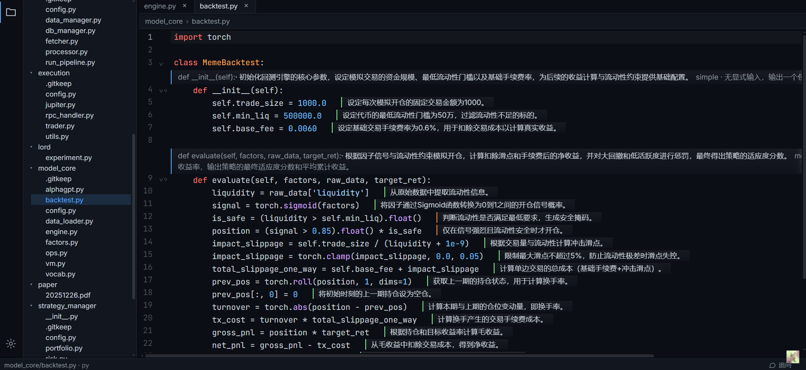

# Fluid

Fluid提供**只读**代码理解环境。在不修改源码任何字节的前提下,用 LLM 为你打开的每个文件生成人类可读的语义投影——函数摘要、逐行解释、可追问——帮你看懂代码每一行在做什么。

> 状态:MVP 功能闭环,全部规划切片已完成(见 `docs/切片计划.md`)。

## 核心理念

- **幽灵注释(Ghost Annotation)**:LLM 生成的语义解释,只存在于内存与旁路缓存,**绝不回写源码**。
- **零字节污染(Zero Byte Contamination)**:铁律——所有生成产物只写旁路文件,源码一个字节都不改。
- **文件为激活单元**:打开一个文件 = 对该文件整体生成语义投影;未打开的文件是零数据、零 Token 的真空态。

术语全集见 [`CONTEXT.md`](CONTEXT.md)。

## 页面



## 能力一览

- **只读浏览**:文件树导航 + CodeMirror 6 只读编辑器(暗色主题、字号可调)。
- **流式语义生成**:每个函数一个「胶囊」(签名·摘要·复杂度·IO)+ 重点行尾随式玻璃注释,逐个显影;失败可单点重试。
- **旁路缓存**:产物落盘 `.fluid/`,键含文件内容 hash + 模型/prompt 版本;重开未变文件零 Token 秒显。
- **追问器**:针对当前文件的流式问答(Markdown + LaTeX 渲染);上下文超窗自动分层降级,可按需追源,支持**跨文件**取被调函数/类实现(经知识图谱定位)。
- **手动单行补注**:非重点行 hover → 「解释这一行」按需生成。
- **类 VSCode 壳**:活动栏 / 资源管理器 / 多 tab + 面包屑 / 状态栏 / Open Folder 换根 / 命令面板 / LLM 设置面板。
- **知识图谱增强(推荐)**:存在 `.understand-anything/knowledge-graph.json` 时作为上下文增强——文件摘要、调用关系、跨文件取源;缺失不影响运行,但**最佳体验是先跑 understand-anything**(见「快速开始」)。

## 架构

```
后端 crates/fluid-server  (Rust · axum + tokio)
  ProjectReader  读文件树/源码(路径穿越防护)
  GraphLoader    可选加载 understand-anything 图谱
  ContextAssembler 装配生成/追问上下文(分层降级 + 跨文件取源)
  LlmProxy       唯一出网组件,OpenAI 兼容 /chat/completions(流式 + 非流式)
  CacheStore     旁路缓存 .fluid/
  routes         REST + WebSocket 端点

前端 web/  (Vue 3 + Vite + TypeScript)
  CodeMirror 6 只读编辑器 + 幽灵注释 widget(玻璃材质)
  tree-sitter WASM 解析(Python / Rust)→ 函数清单 + 重点行
  GhostStore 内存态 + 视口感知生成调度(并行 WS)
  shell/ 类 VSCode 壳组件
```

设计取舍见 [`docs/adr/`](docs/adr/);整体方案见 `docs/技术方案.md`。

## 安装(预编译二进制,推荐)

无需 Rust / Node,前端已打包进二进制,单进程即整个 app。

**macOS / Linux** — 一行装好(`fluid` 进 PATH):

```bash
curl -fsSL https://github.com/adaelon/Fluid/releases/latest/download/install.sh | sh
fluid /path/to/your/project        # 或直接 fluid,启动后在界面里「打开文件夹」
```

**Windows** — 从 [Releases](https://github.com/adaelon/Fluid/releases) 下载 `fluid-windows-x86_64.exe` 放到任意文件夹。它是**命令行程序,要在 PowerShell / cmd 里运行,不要双击**(双击会一闪而过):

```powershell
# 形态: <exe 路径>  <要阅读的项目目录>
文件夹\fluid-windows-x86_64.exe E:\allwork\download\agent\alphaGPT

# 也可不带项目目录,启动后在界面左侧「打开文件夹…」里选:
文件夹\fluid-windows-x86_64.exe

# 换端口: --port 7879
```

启动后后端+前端在同一端口,默认自动打开 **http://127.0.0.1:7878**(没自动开就手动访问)。

> **最佳体验:先对目标项目跑一遍 [understand-anything](https://github.com/Understand-Anything)**,在项目根生成 `.understand-anything/knowledge-graph.json`。Fluid 没有它也能跑(纯只读浏览 + 单文件生成/追问),但有了图谱才解锁:文件级摘要、调用/导入关系上下文,以及追问时**跨文件取被调函数/类的实现**(S10c 依赖图谱定位)。
>
> 别在被服务项目自带 `.env` 的目录里启动 fluid(会读错 LLM 配置);从其他目录启动即可。

## 从源码运行 / 开发

需要 Rust(stable)与 Node(建议 ≥ 20;校验脚本用 Node 24 原生跑 TS)。

```bash
# 单二进制(同发行版形态:前端打包进后端,一条命令起整个 app)
npm --prefix web ci && npm --prefix web run build   # 构建前端 → web/dist(被后端嵌入)
cargo run -p fluid-server -- /path/to/your/project  # 浏览器自动开 http://127.0.0.1:7878

# 开发热重载(前端改动即时生效,两进程)
cargo run -p fluid-server -- /path/to/your/project  # 后端 7878
cd web && npm install && npm run dev                # Vite 5173,/api 代理到 7878 → 开 127.0.0.1:5173
```

> 用 `127.0.0.1`,不要用 `localhost`——后端只绑 IPv4。

## 配置 LLM 后端

三个值:`OPENCODE_API_KEY`(必需)、`OPENCODE_BASE_URL`(默认 `https://opencode.ai/zen/go/v1`)、`FLUID_LLM_MODEL`(默认 `glm-5.1`)。两种方式:

- **`.env` 文件**(复制 `.env.example`):启动时由 `dotenvy` 加载。
- **运行时设置面板**:活动栏底部齿轮 → 居中模态,改 base/model/key → 保存即热生效(无需重启)并回写 `.env`。密钥 **write-only**:只显示掩码末 4 位,留空即保持原值。可「测试连接」做一次最小探针。

仅支持 OpenAI 兼容 `/chat/completions`。

## 快捷键

| 键 | 作用 |
|---|---|
| `Ctrl/Cmd+P` | 快速打开文件(模糊查找) |
| `Ctrl/Cmd+Shift+P` | 命令面板(设置 / 打开文件夹 / 切换追问器 / 关闭标签页) |
| `Ctrl/Cmd+=` `-` `0` | 代码区字号 放大 / 缩小 / 复位 |
| `Esc` | 关闭面板 / 模态 |

## 主要端点

`GET /api/project/tree`、`GET /api/file`、`GET /api/project/graph`、`POST /api/project/open|pick`、`GET|POST /api/settings/llm`、`POST /api/settings/llm/test`、`POST /api/explain-line`、`WS /api/generate`、`WS /api/query`。

## 开发与验证

```bash
# 后端
cargo test -p fluid-server      # 单元 + 集成(确定性)
cargo clippy -p fluid-server

# 前端
cd web
npm run build                   # vue-tsc 类型检查 + vite 构建
node scripts/fuzzy-check.ts     # 命令面板模糊匹配
node scripts/scheduler-check.ts # 生成调度核
node scripts/parse-check.ts     # tree-sitter 解析
node scripts/markdown-check.ts  # 追问答案渲染
```

验证纪律:用确定性工具判定对错(编译/测试/脚本),不靠 AI 自评;纯浏览器视觉/真 LLM 路径在文档里诚实标注「留眼验」。

## 文档地图

- [`CONTEXT.md`](CONTEXT.md) — 术语表(每个名词「是什么」)
- `docs/技术方案.md` — 整体技术方案
- [`docs/切片计划.md`](docs/切片计划.md) — 切片清单与状态
- [`docs/代码链路.md`](docs/代码链路.md) — 改动账本(每刀触达 `文件:符号`)
- [`docs/adr/`](docs/adr/) — 架构决策记录
- [`SESSION_CHECKPOINT.md`](SESSION_CHECKPOINT.md) — 会话热启动盘
