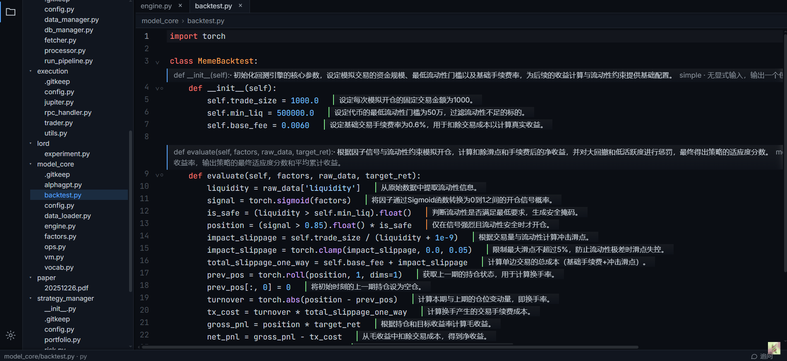

# Fluid

Fluid提供**只读**代码理解环境。在不修改源码任何字节的前提下,用 LLM 为你打开的每个文件生成人类可读的语义投影——函数摘要、逐行解释、可追问——帮你看懂代码每一行在做什么。

> 状态:MVP 功能闭环;代码选区解释与共享联网检索、文件定向卡、项目级追问历史、陈旧证据护栏及左栏/底栏/专注三态追问均已完成(见 `docs/切片方案-代码选区解释与共享联网检索.md`、`docs/切片方案-文件定向卡与证据化追问.md`、`docs/切片方案-追问线程持久化与左栏工作台.md`)。

## 核心理念

- **幽灵注释(Ghost Annotation)**:LLM 生成的语义解释,只存在于内存与旁路缓存,**绝不回写源码**。
- **零字节污染(Zero Byte Contamination)**:铁律——所有生成产物只写旁路文件,源码一个字节都不改。
- **文件为激活单元**:打开一个文件 = 对该文件整体生成语义投影;未打开的文件是零数据、零 Token 的真空态。

术语全集见 [`CONTEXT.md`](CONTEXT.md)。

## 页面



## 能力一览

- **只读浏览**:文件树导航 + CodeMirror 6 只读编辑器(暗色主题、字号可调)。
- **文件定向卡**:代码文件激活后先显示具名参与者、核心方向、贯穿示例、外围能力与源码锚点;通过确定性校验后才生成共享同一坐标系的函数胶囊。
- **流式语义生成**:每个函数一个「胶囊」(签名·摘要·复杂度·IO)+ 重点行尾随式玻璃注释,逐个显影;失败可单点重试。
- **代码选区解释**:选择任意非空单行代码后点「解释」,临时浮层显示「它是什么 / 这里做什么 / 来源状态」;项目内符号优先临时取源,第三方证据不足时可自动联网。
- **旁路缓存**:文件定向卡、函数/行与选区解释都落盘 `.fluid/`;相关源码、图谱、模型、Prompt、选区范围或联网模式不变时零 Token 秒显,解释文本始终不回写源码。
- **项目级证据化追问**:当前文件追问先显示确定性方向图,再流式回答;完整轮次按项目保存,关闭追问器、切换文件或重启 Fluid 后仍可恢复。也可显式选择多个文件做职责/调用/依赖关系追问;两种范围共享供应商托管 Web Search,并显示「网页有来源 / 联网无来源 / 未核验」。
- **源码版本护栏**:线程绑定当前文件或已选文件集的精确源码版本;源码变化后旧回答仍可读,但续问和代码 `[E#]` 回切会禁用。内容变化可基于当前源码另建零轮次线程,范围文件缺失时只读且不可 fork。
- **三态追问工作台**:活动栏可在资源管理器、追问器和收起左栏间互斥切换;同一个追问器可在左栏、底栏与专注态间移动,线程、输入与在途请求不因换位而重建。
- **联网可控**:设置里的「允许联网检索」默认开启,同时控制选区解释与追问器;关闭后不做检索规划或 Web Search,只使用本地上下文。
- **手动单行补注**:非重点行 hover → 「解释这一行」按需生成。
- **类 VSCode 壳**:活动栏 / 资源管理器 / 多 tab + 面包屑 / 状态栏 / Open Folder 换根 / 命令面板 / LLM 设置面板。
- **知识图谱增强(推荐)**:项目或子项目存在 `.ua/knowledge-graph.json` 时作为导航增强,并兼容旧 `.understand-anything/knowledge-graph.json`;多作用域按最近祖先归属,源码始终是真相。图谱缺失不影响单文件运行,但**最佳体验是先跑 understand-anything**(见「快速开始」)。

## 架构

```
后端 crates/fluid-server  (Rust · axum + tokio)
  ProjectReader  读文件树/源码(路径穿越防护)
  GraphCatalog   可选发现根/嵌套 understand-anything 图谱并解析最近作用域
  OrientationProtocol 校验文件参与者、方向、函数角色与源码锚点
  ContextAssembler 装配生成/追问上下文(有界取源 + EvidenceCatalog + QueryMap)
  WebEvidenceService 共享 local → plan → search → fallback 证据编排
  LlmProxy       唯一出网组件,/chat/completions + 可选 /responses Web Search
  CacheStore     旁路缓存 .fluid/
  QueryThreadStore 项目级完整追问记录 .fluid/query-threads/v1/
  routes         REST + WebSocket 端点

前端 web/  (Vue 3 + Vite + TypeScript)
  CodeMirror 6 只读编辑器 + 幽灵注释 widget(玻璃材质)
  tree-sitter WASM 解析(Python / Rust)→ 函数清单 + 重点行
  GhostStore 内存态 + 视口感知生成调度(并行 WS)
  QueryWorkspace 单一项目态持有历史、线程选择、流式请求与换根代次
  OrientationState / SelectionState / QueryState 投影激活、选区、连续追问与证据状态
  shell/ 类 VSCode 壳组件
```

设计取舍见 [`docs/adr/`](docs/adr/);整体方案见 `docs/技术方案.md`。

## 安装(预编译二进制,推荐)

无需 Rust / Node,前端已打包进二进制,单进程即整个 app。

**macOS / Linux** — 一行装好(`fluid` 进 PATH):

```bash
curl -fsSL https://github.com/adaelon/Fluid/releases/latest/download/install.sh | sh
fluid /path/to/your/project        # 或直接 fluid,启动后在界面里「打开文件夹」
```

**Windows** — 从 [Releases](https://github.com/adaelon/Fluid/releases) 下载 `fluid-windows-x86_64.exe` 放到任意文件夹。可以直接双击:无参数启动会保留控制台、自动打开网页,再从页面选择项目文件夹。控制台承载运行日志,关闭它或按 `Ctrl+C` 即退出 Fluid。

```powershell
# 形态: <exe 路径>  <要阅读的项目目录>
文件夹\fluid-windows-x86_64.exe E:\allwork\download\agent\alphaGPT

# 也可不带项目目录,启动后在界面左侧「打开文件夹…」里选:
文件夹\fluid-windows-x86_64.exe

# 换端口: --port 7879
```

未传 `--port` 时优先使用 **http://127.0.0.1:7878**:若该端口已有 Fluid,新启动会复用并打开现有页面;若被其他程序占用,Fluid 会自动选择空闲端口并在控制台打印实际 URL。显式 `--port N` 保持严格,N 被占用时直接报错,不会静默换端口。

> **最佳体验:先对目标项目跑一遍 [understand-anything](https://github.com/Understand-Anything)**,生成现行 `.ua/knowledge-graph.json`(旧 `.understand-anything/knowledge-graph.json` 仍兼容)。Fluid 没有它也能跑(纯只读浏览 + 单文件定向/生成/追问),但有了图谱才解锁:文件级摘要、调用/导入关系导航、文件集关系追问,以及追问时**跨文件取被调函数/类的实现**;嵌套子项目可各自持有图谱。
>
> Windows 配置已与启动目录解耦,不会再误读被服务项目自带的 `.env`;固定位置与旧版迁移方式见「配置 LLM 后端」。

## 从源码运行 / 开发

需要 Rust(stable)与 Node(建议 ≥ 20;校验脚本用 Node 24 原生跑 TS)。

```bash
# 单二进制(同发行版形态:前端打包进后端,一条命令起整个 app)
npm --prefix web ci && npm --prefix web run build   # 构建前端 → web/dist(被后端嵌入)
cargo run -p fluid-server -- /path/to/your/project  # 浏览器自动开 http://127.0.0.1:7878

# 开发热重载(前端改动即时生效,两进程)
cargo run -p fluid-server -- /path/to/your/project  # 后端 7878
cd web && npm install && npm run dev                # Vite 5173,/api 代理到 7878 → 开 127.0.0.1:5173
```

> 用 `127.0.0.1`,不要用 `localhost`——后端只绑 IPv4。

## 配置 LLM 后端

三个值:`OPENCODE_API_KEY`(必需)、`OPENCODE_BASE_URL`(默认 `https://opencode.ai/zen/go/v1`)、`FLUID_LLM_MODEL`(默认 `glm-5.1`)。启动优先级是**显式进程环境变量 > Fluid 配置文件 > 内置默认值**。

- **Windows 配置文件**:`%LOCALAPPDATA%\Fluid\.env`。可把 `.env.example` 的三项复制过去,也可直接在设置面板首次保存(目录和文件会自动创建)。Fluid 不再搜索启动目录或其祖先的 `.env`。
- **macOS / Linux 配置文件**:保留既有行为,从启动目录及其祖先查找 `.env`。
- **运行时设置面板**:活动栏底部齿轮 → 居中模态,改 base/model/key → 保存即热生效(无需重启)并回写上述平台配置路径。密钥 **write-only**:只显示掩码末 4 位,留空即保持原值。可「测试连接」做一次最小探针。

从旧版 Windows Fluid 升级时,启动目录附近的旧 `.env` **不会自动复制或继续读取**,以免再次误用项目自己的配置。请一次性把其中三项复制到 `%LOCALAPPDATA%\Fluid\.env`,或启动后在设置面板重新保存;若一直使用系统/终端显式环境变量,无需迁移文件。

常规生成要求 OpenAI 兼容 `/chat/completions`;选区解释与追问器还会在当前供应商/模型支持时调用 `/responses` 的 `web_search` 工具。联网请求只接收先行规划得到的公开检索请求,不直接附加原始源码;供应商不支持、认证失败、限流或超时时显式降级为本地回答。设置面板可关闭联网检索。

## 快捷键

| 键 | 作用 |
|---|---|
| `Ctrl/Cmd+P` | 快速打开文件(模糊查找) |
| `Ctrl/Cmd+Shift+P` | 命令面板(设置 / 打开文件夹 / 切换追问器 / 关闭标签页) |
| `Ctrl/Cmd+=` `-` `0` | 代码区字号 放大 / 缩小 / 复位 |
| `Esc` | 关闭面板 / 模态 |

## 主要端点

`GET /api/identity`、`GET /api/project/tree`、`GET /api/file`、`GET /api/project/graph`、`POST /api/project/open|pick`、`GET|POST /api/settings/llm`、`POST /api/settings/llm/test`、`POST /api/explain-line`、`GET|POST /api/query-threads`、`GET|DELETE /api/query-threads/{id}`、`POST /api/query-threads/{id}/fork-current`、`WS /api/orient`、`WS /api/generate`、`WS /api/explain-selection`、`WS /api/query`、`WS /api/query-files`。

## 开发与验证

```bash
# 后端
cargo test -p fluid-server      # 单元 + 集成(确定性)
cargo clippy -p fluid-server -- -D warnings

# 前端
cd web
npm run build                   # vue-tsc 类型检查 + vite 构建
node scripts/fuzzy-check.ts     # 命令面板模糊匹配
node scripts/scheduler-check.ts # 生成调度核
node scripts/parse-check.ts     # tree-sitter 解析
node scripts/markdown-check.ts  # 追问答案渲染
node scripts/selection-check.ts # 选区 UTF-8 range + 状态机
node scripts/orientation-check.ts # 文件定向激活闸门
node scripts/capsule-check.ts # 胶囊定向坐标展示
node scripts/query-context-check.ts # 追问上下文投影
node scripts/query-trace-check.ts # 连续追问 scope/revision 轨迹
node scripts/query-map-check.ts # map 帧序与 E# 链接
node scripts/query-web-check.ts # 两种 scope 的联网证据状态机
npx tsx scripts/query-history-check.ts # 项目历史、重启恢复与删除竞态
npx tsx scripts/query-stale-check.ts # stale 只读、fork 与 E# 护栏
npx tsx scripts/query-workspace-check.ts # 单一 controller 与请求代次
node scripts/query-layout-check.ts # dock/focus 尺寸边界
node scripts/query-presentation-check.ts # 单轮呈现索引
node scripts/query-sidebar-check.ts # 左栏/底栏/专注布局状态机
```

验证纪律:用确定性工具判定对错(编译/测试/脚本),不靠 AI 自评;浏览器交互用本地 fixture 复验,真实供应商 Web Search 仅作补充冒烟。无余额、无能力或无网络时必须记录「未验证」,不得用 fixture 结果冒充真实联网成功。

## 文档地图

- [`CONTEXT.md`](CONTEXT.md) — 术语表(每个名词「是什么」)
- `docs/技术方案.md` — 整体技术方案
- [`docs/切片计划.md`](docs/切片计划.md) — 切片清单与状态
- [`docs/代码链路.md`](docs/代码链路.md) — 改动账本(每刀触达 `文件:符号`)
- [`docs/adr/`](docs/adr/) — 架构决策记录
- [`SESSION_CHECKPOINT.md`](SESSION_CHECKPOINT.md) — 会话热启动盘
